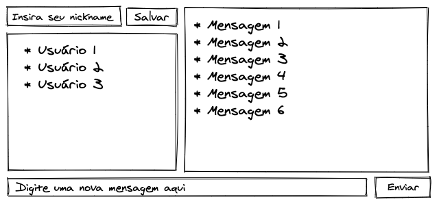

### Termos e acordos

Ao iniciar este projeto, você concorda com as diretrizes do Código de Ética e Conduta e do Manual da Pessoa Estudante da Trybe.

# Boas vindas ao repositório do projeto WebChat!

Você já usa o GitHub diariamente para desenvolver os exercícios, certo? Agora, para desenvolver os projetos, você deverá seguir as instruções a seguir. Fique atento a cada passo, e se tiver qualquer dúvida, nos envie por _Slack_! \#vqv 🚀

Aqui você vai encontrar os detalhes de como estruturar o desenvolvimento do seu projeto a partir desse repositório, utilizando uma branch específica e um _Pull Request_ para colocar seus códigos.

# Sumário

- [Habilidades](#habilidades)
- [Entregáveis](#entregáveis)
  - [O que deverá ser desenvolvido](#o-que-deverá-ser-desenvolvido)
  - [Desenvolvimento](#desenvolvimento)
  - [Data de entrega](#data-de-entrega)
- [Instruções para entregar seu projeto](#instruções-para-entregar-seu-projeto)
  - [Antes de começar a desenvolver](#-antes-de-começar-a-desenvolver)
  - [Durante o desenvolvimento](#durante-o-desenvolvimento)
- [Como desenvolver](#como-desenvolver)
  - [Linter (Análise Estática)](#linter-análise-estática)
  - [Variáveis](#variáveis)
  - [Conexão com o banco](#conexão-com-o-banco)
- [Requisitos do projeto](#requisitos-do-projeto)
  - [Lista de Requisitos](#lista-de-requisitos)
    `Requisitos Obrigatórios`
    - [1 - Crie um back-end para conexão simultaneamente de clientes e troca de mensagens em chat público](#1---crie-um-back-end-para-conexão-simultânea-de-clientes-e-troca-de-mensagens-em-chat-público)
    - [2 - Crie um frontend para que as pessoas interajam com o chat](#2---crie-um-frontend-para-que-as-pessoas-interajam-com-o-chat)
    - [3 - Elabore o histórico do chat para que as mensagens persistam](#3---elabore-o-histórico-do-chat-para-que-as-mensagens-persistam)
    - [4 - Informe a todos os clientes quem está online no momento](#4---informe-a-todos-os-clientes-quem-está-online-no-momento)
- [Depois de terminar o desenvolvimento (opcional)](#depois-de-terminar-o-desenvolvimento-opcional)
- [Revisando um pull request](#revisando-um-pull-request)
- [Avisos Finais](#avisos-finais)

---

# Habilidades

- Conseguir desenvolver um server socket usando o socket.io;

- Emitir eventos personalizados usando o socket.io;

- Usar o pacote `socket.io` do Node.js para criar aplicações que trafeguem mensagens através de sockets.

---

# Entregáveis

---

## O que deverá ser desenvolvido
Neste projeto você vai desenvolver um _chat_ online e ao utilizar essa aplicação um usuário deverá ser capaz de:

 - Usar um front-end para enviar mensagens a clientes conectados;
 - Visualizar o histórico de mensagens da conversa;
 - Visualizar os usuários online no momento;
 - Alterar o nome de usuário no chat em tempo real;

O desenho abaixo demonstra como o projeto pode ser estruturado ao decorrer do desenvolvimento, use a sua criatividade para surpreender! 🧑‍🎨




Para entregar o seu projeto você deverá criar um Pull Request neste repositório.

Lembre-se que você pode consultar nosso conteúdo sobre [Git & GitHub](https://course.betrybe.com/intro/git/) sempre que precisar!

## Desenvolvimento

Deverá ser desenvolvida uma aplicação `Node.js` de _chat_, usando `socket.io` para emitir eventos e atualizar estado no servidor e cliente.

Através do cliente será possível enviar e receber mensagens, trocar seu nome, ver usuários online.

O MVC será usado para renderizar as mensagens do histórico e usuários online, com ambos vindo direto do servidor.

### Data de Entrega

  - Projeto individual.

  - Serão `X` dias de projeto.

  - Data de entrega para avaliação final do projeto: `DD/MM/YYYY - 14:00h`.

---

### 👀 Observações importantes:

- Você tem liberdade para adicionar novos comportamentos ao seu projeto, seja na forma de aperfeiçoamentos em requisitos propostos ou novas funcionalidades, **desde que tais comportamentos adicionais não conflitem com os requisitos propostos**.

  - Em outras palavras, você pode fazer mais do que for pedido, mas nunca menos.

- Contudo, tenha em mente que **nada além do que for pedido nos requisitos será avaliado**. _Esta é uma oportunidade de você exercitar sua criatividade e experimentar com os conhecimentos adquiridos._

#### Leia todo este documento e se inteire de tudo que o projeto pede antes de começar o desenvolvimento. Montar uma estratégia para construir o projeto e atender os seus requisitos faz parte do trabalho.

# Instruções para entregar seu projeto:

## 🗒 Antes de começar a desenvolver

1. Clone o repositório

   - `git clone https://github.com/tryber/sd-0x-project-webchat.git`.
   - Entre na pasta do repositório que você acabou de clonar:
     - `cd sd-0x-project-webchat`

2. Crie uma branch a partir da branch `master`

   - Verifique que você está na branch `master`
     - Exemplo: `git branch`
   - Se não estiver, mude para a branch `master`
     - Exemplo: `git checkout master`
   - Agora, crie uma branch onde você vai guardar os `commits` do seu projeto
     - Você deve criar uma branch no seguinte formato: `nome-de-usuario-nome-do-projeto`
     - Exemplo: `git checkout -b joaozinho-webchat-project`

3. Crie na raiz do projeto os arquivos que você precisará desenvolver:

   - Verifique que você está na raiz do projeto
     - Exemplo: `pwd` -> o retorno vai ser algo tipo _/Users/joaozinho/code/**sd-0x-project-webchat**_

4. Adicione as mudanças ao _stage_ do Git e faça um `commit`

   - Verifique que as mudanças ainda não estão no _stage_
     - Exemplo: `git status` (devem aparecer listados os novos arquivos em vermelho)
   - Adicione o novo arquivo ao _stage_ do Git
     - Exemplo:
       - `git add .` (adicionando todas as mudanças - _que estavam em vermelho_ - ao stage do Git)
       - `git status` (devem aparecer listados os arquivos em verde)
   - Faça o `commit` inicial
     - Exemplo:
       - `git commit -m 'iniciando o projeto. VAMOS COM TUDO :rocket:'` (fazendo o primeiro commit)
       - `git status` (deve aparecer uma mensagem tipo _nothing to commit_ )

5. Adicione a sua branch com o novo `commit` ao repositório remoto

   - Usando o exemplo anterior: `git push -u origin joaozinho-webchat-project`

6. Crie um novo `Pull Request` _(PR)_

   - Vá até a página de _Pull Requests_ do [repositório no GitHub](https://github.com/tryber/sd-0x-project-webchat/pulls)
   - Clique no botão verde _"New pull request"_
   - Clique na caixa de seleção _"Compare"_ e escolha a sua branch **com atenção**
   - Clique no botão verde _"Create pull request"_
   - Adicione uma descrição para o _Pull Request_, um título claro que o identifique, e clique no botão verde _"Create pull request"_
   - **Não se preocupe em preencher mais nada por enquanto!**
   - Volte até a [página de _Pull Requests_ do repositório](https://github.com/tryber/sd-0x-project-webchat/pulls) e confira que o seu _Pull Request_ está criado

---

## Durante o desenvolvimento

⚠ **RECOMENDAMOS QUE VOCÊ FIQUE ATENTO ÀS ISSUES DO CODE CLIMATE, PARA RESOLVÊ-LAS ANTES DE FINALIZAR O DESENVOLVIMENTO.** ⚠

- Faça `commits` das alterações que você fizer no código regularmente;

- Lembre-se de sempre após um ~~(ou alguns)~~ `commits` atualizar o repositório remoto (o famoso `git push`);

- Os comandos que você utilizará com mais frequência são:

  1. `git status` _(para verificar o que está em vermelho - fora do stage - e o que está em verde - no stage)_;

  2. `git add` _(para adicionar arquivos ao stage do Git)_;

  3. `git commit` _(para criar um commit com os arquivos que estão no stage do Git)_;

  4. `git push -u origin nome-da-branch` _(para enviar o commit para o repositório remoto na primeira vez que fizer o `push` de uma nova branch)_;

  5. `git push` _(para enviar o commit para o repositório remoto após o passo anterior)_.

---

# Como desenvolver

## Linter (Análise Estática)

Para garantir a qualidade do código, usaremos o [ESLint](https://eslint.org/) para fazer a sua análise estática.

Este projeto já vem com as dependências relacionadas ao _linter_ configuradas nos arquivos `package.json` nos seguintes caminhos:

- `sd-0x-project-webchat/package.json`

Para poder rodar os `ESLint` em um projeto basta executar o comando `npm install` dentro do projeto e depois `npm run lint`. Se a análise do `ESLint` encontrar problemas no seu código, tais problemas serão mostrados no seu terminal. Se não houver problema no seu código, nada será impresso no seu terminal.

Você também pode instalar o plugin do `ESLint` no `VSCode`, bastar ir em extensions e baixar o [plugin `ESLint`](https://marketplace.visualstudio.com/items?itemName=dbaeumer.vscode-eslint).

## Variáveis

Haverá um arquivo no caminho: `sd-0x-project-webchat/models/connection.js` que fará a conexão com o Banco de Dados. Neste arquivo, na linha 9, haverá o seguinte comando:

`.connect(process.env.DB_URL, {`

e na linha 13:

`.then((conn) => conn.db(process.env.DB_NAME))`

**Você irá precisar configurar as variáveis globais do MongoDB.** Você pode usar esse [Conteúdo de variáveis de ambiente com NodeJS](https://blog.rocketseat.com.br/variaveis-ambiente-nodejs/) como referência.

** ⚠️ Neste projeto é obrigatório deixar o nome do database como `webchat` **

## Conexão com o banco:
As variáveis de ambiente receberão os seguintes valores

```
DB_URL=mongodb://localhost:27017/webchat/    // conexão local com o seu MongoDB
DB_NAME=webchat                             // nome do database
```

## Testes

Para executar os testes localmente, você pode rodar o comando `npm test`.

Caso prefira testar um requisito por vez pode executar o teste da seguinte forma: `npm test tests/req1` (nesse caso testa apenas o requisito 1)

⚠️ Antes de executar os testes requisitos, principalmente do requisito 4, feche o seu navegador, pois ele pode afetar a execução dos testes.

---

# Requisitos do projeto

## Lista de Requisitos

### 1 - Crie um back-end para conexão simultânea de clientes e troca de mensagens em chat público.

#### ⚠️ &nbsp; DICA: Para desenvolver esse requisito não é necessário se conectar ao banco de dados.

- Sua aplicação deve ser inicializada no arquivo `server.js`;

- Seu back-end deve permitir que vários clientes se conectem simultaneamente;

- Seu back-end deve permitir que cada cliente mande mensagens para todas os outros clientes online de forma simultânea;

- Toda mensagem que um cliente recebe deve conter as informações acerca de quem a enviou: _nickname_ (apelido), data-hora do envio e o conteúdo da mensagem em si.

 - O evento da mensagem deve ter o nome `message` e deve enviar como parâmetro o objeto `{ chatMessage, nickname }`. O `chatMessage` deve ser a mensagem enviada enquanto o `nickname` deverá ser o apelido de quem a enviou;

 - A data na mensagem deve seguir o padrão 'dd-mm-yyyy' e o horário deve seguir o padrão 'hh:mm:ss' sendo os segundos opcionais;

 - O formato da mensagem deve seguir esse padrão:

`DD-MM-yyyy HH:mm:ss ${nickname} ${chatMessage}`

- Exemplo prático:

`09-10-2020 2:35:09 PM - Joel: Olá meu caros amigos!`

- O back-end deve enviar a mensagem ao front-end **já formatada**, ela deve ser uma `string`, como no exemplo acima;

- Tanto o evento enviado do cliente para o servidor, como do servidor para o cliente deve ser **message**.


#### As seguintes verificações serão feitas:
```
- Será validado que todos os clientes que estão conectados ao chat recebem as mensagens enviadas;

- Será validado que toda mensagem que um cliente recebe contém as informações acerca de quem a enviou, data-hora do envio e o conteúdo da mensagem em si.
```
---

### 2 - Crie um frontend para que as pessoas interajam com o chat.

#### ⚠️ &nbsp; DICA: Para desenvolver esse requisito não é necessário se conectar ao banco de dados.

#### ⚠️ &nbsp; DICA: Para facilitar armazenar e/ou recuperar o _nickname_ do cliente, lembre-se de usar o _localStorage_.

- O front-end e o back-end têm que usar a mesma porta - `localhost:3000`;

- O front-end deve gerar um um _nickname_ **aleatório de 16 caracteres** quando um novo cliente se conecta, para identificar quem está enviando a mensagem.
  - O elemento com o nome do cliente deve conter o `data-testid="online-user"`.

- O front-end deve ter uma caixa de texto através da qual seja possível enviar mensagens para o _chat_:
  - A caixa de texto deve conter o `data-testid="message-box"`;
  - O botão de enviar mensagem deve conter o `data-testid="send-button"`.

- As mensagens devem ser renderizadas na tela;
  - Cada mensagem deve conter o `data-testid="message"`.

- O front-end deve exibir todas as mensagens já enviadas no _chat_, ordenadas verticalmente da mais antiga para a mais nova _(as mensagens mais recentes devem aparecer abaixo das mensagens mais antigas)_;

- O front-end deve permitir a quem usa escolher um apelido (_nickname_) para si. Para que a pessoa usuária consiga escolher um apelido, o front-end deve ter um campo de texto e um botão. O campo de texto será onde a pessoa digitará o _nickname_ que deseja. Após escolher o _nickname_, o cliente deverá clicar no botão para que o dado seja salvo:
  - O campo onde o _nickname_ será inserido deve conter o `data-testid="nickname-box"`;
  - O botão que será clicado para salvar o _nickname_ deve conter `data-testid="nickname-button"`;
  - Ao salvar o _nickname_ ele deve ser atualizado para todos os clientes conectados.


#### As seguintes verificações serão feitas:
```
- Será validado que um _nickname_ aleatório é gerado quando o cliente se conecta;

- Será validado que o front-end tem uma caixa de texto para preencher e um botão para enviar mensagens;

- Será validado que as mensagens enviadas possuem o _data-test-id_ correto;

- Será validado que as mensagens são exibidas na ordem correta;

- Será validado que o front-end tem um campo de texto para preencher e um botão para alterar o apelido _(nickname)_;

- Será validado que é possível enviar mensagens após alterar o _nickname_.
```
---

### 3 - Elabore o histórico do chat para que as mensagens persistam.

#### ⚠️ &nbsp; DICA: Para desenvolver esse requisito é estritamente necessário se conectar ao banco de dados.

#### ⚠️ &nbsp; DICA: Uma boa forma de renderizar o histórico de mensagens via HTML é usando uma template engine _(exemplo: EJS)_.

#### ⚠️ &nbsp; DICA: Lembre-se de aplicar a arquitetura MVC.

- Você deve configurar o banco de dados `webchat` com uma coleção chamada `messages`, em que cada documento representa uma mensagem;

- O seu banco de dados deve salvar o _nickname_ de quem enviou a mensagem, a mensagem em si e uma _timestamp_ com precisão de segundos de quando ela foi salva no banco;

  - Exemplo de um documento:
      ```js
      {
        message: 'Lorem ipsum',
        nickname: 'xablau',
        timestamp: '2021-04-01 12:00:00'
      }
      ```

- Envie o histórico de mensagens salvo no banco via `html` quando um novo cliente se conectar.

#### As seguintes verificações serão feitas:
```
- Será validado que todo o histórico de mensagens irá aparecer quando o cliente se conectar;

- Será validado que ao enviar uma mensagem e recarregar a página, a mensagem persistirá;

- Será validado que ao alterar o _nickname_ e enviar uma mensagem, a mensagem persistirá;
```
---

### 4 - Informe a todos os clientes quem está online no momento.

#### ⚠️ &nbsp; DICA: Para desenvolver esse requisito não é necessário se conectar ao banco de dados.

- No front-end deve haver uma lista na tela de cada cliente que mostra quais clientes estão _online_ em um dado momento. Um cliente é identificado pelo seu _nickname_.
  - O elemento com o nome do cliente deve conter o `data-testid="online-user"`;
  - Quando um cliente se conecta, a lista de clientes deve ser atualizada para todos:
      - Para o cliente que acabou de se conectar, seu nickname deve ser colocado no começo da lista;
      - Para os demais clientes, o nickname do cliente que acabou de se conectar deve ser colocado no final da lista.
  - A lista de clientes _online_ deve ser renderizada no `html` ao carregar a página;
  - Quando um cliente atualiza seu _nickname_ a lista de clientes deve ser atualizada para todos da mesma forma.


#### As seguintes verificações serão feitas:
```
- Será validado que quando um cliente se conecta, seu _nickname_ aparece no front-end de todos;

- Será validado que quando um cliente se desconecta, seu _nickname_ desaparece do front-end dos outros clientes;

- Será validado que quando um cliente atualiza seu _nickname_, o nickname é atualizado no front-end de todos os clientes;

- Será validado que os _nicknames_ são mostrados na ordem correta.
```

---

## Dicas

:star: Tomar decisões de projeto em prol do bom desenvolvimento faz parte do projeto! Interprete os requisitos, tome suas decisões e, em caso de dúvidas, valide-as conosco no _Slack_!

---

# Depois de terminar o desenvolvimento (OPCIONAL)

Para sinalizar que o seu projeto está pronto para o _"Code Review"_ dos seus colegas, faça o seguinte:

- Vá até a página **DO SEU** _Pull Request_, adicione a label de _"code-review"_ e marque seus colegas:

  - No menu à direita, clique no _link_ **"Labels"** e escolha a _label_ **code-review**;

  - No menu à direita, clique no _link_ **"Assignees"** e escolha **o seu usuário**;

  - No menu à direita, clique no _link_ **"Reviewers"** e digite `students`, selecione o time `tryber/students-sd-0x`.

Caso tenha alguma dúvida, [aqui tem um video explicativo](https://vimeo.com/362189205).

---

# Revisando um pull request

Use o conteúdo sobre [Code Review](https://course.betrybe.com/real-life-engineer/code-review/) para te ajudar a revisar os _Pull Requests_.

\#VQV 🚀

---

# Avisos Finais

Ao finalizar e submeter o projeto, não se esqueça de avaliar sua experiência preenchendo o formulário. Leva menos de 3 minutos!	Ao finalizar e submeter o projeto, não se esqueça de avaliar sua experiência preenchendo o formulário. Leva menos de 3 minutos!

Link: [FORMULÁRIO DE AVALIAÇÃO DE PROJETO](https://be-trybe.typeform.com/to/ZTeR4IbH)

O avaliador automático **não** necessariamente avalia seu projeto na ordem em que os requisitos aparecem no readme. Isso acontece para deixar o processo de avaliação mais rápido. Então, não se assuste se isso acontecer, ok?
